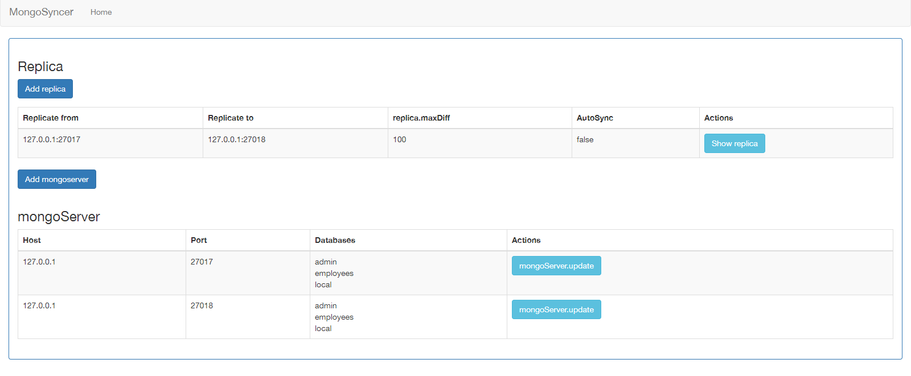
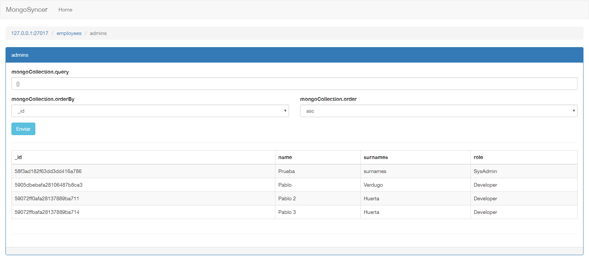

# MongoSyncer

The goal of this project is to replicate the 'replica' (duh!) system of MongoDB in Grails/Groovy.

## Actual features

- Can add MongoDB servers
- Can create replicas (one server to one server)
- Can make a manual iteration
- Can set auto iteration
- Can query collections

## Future features

- Been able to create (one server to many server replicas)

## Latests TODO

- Translations

### TODO X.Times

- Refactor
